<div align="center">


# Cairn

**Plan your adventures together.**

A collaborative, self-hostable trip planner. Cairn turns a scattered pile of
"we should go here" links, screenshots, and notes into one shared trip: a map
of every place you're considering, a reorderable list, tags, photos, and a
note-and-discussion trail for each stop — all live for everyone you're
traveling with.

[](https://react.dev)
[](https://www.typescriptlang.org/)
[](https://vite.dev)
[](https://supabase.com)
[](https://docs.mapbox.com/mapbox-gl-js/)
[](#-install-it-like-an-app)
[](LICENSE)
[](https://github.com/thkleinert/cairn/actions/workflows/ci.yml)

<br />

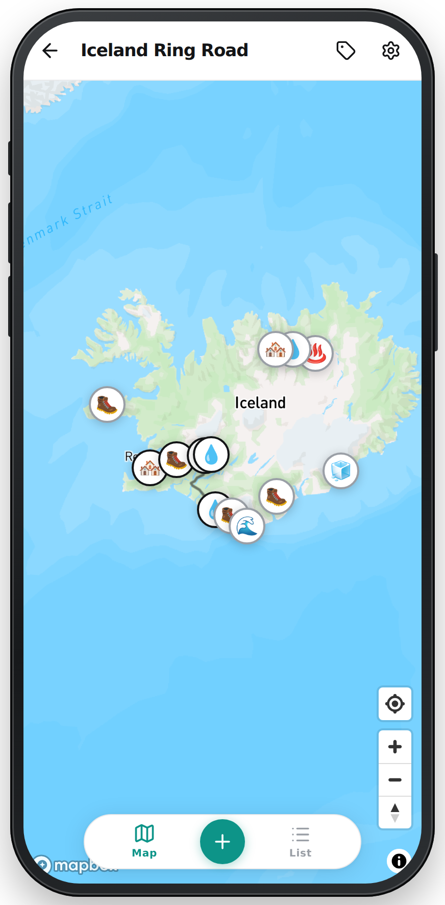&nbsp;
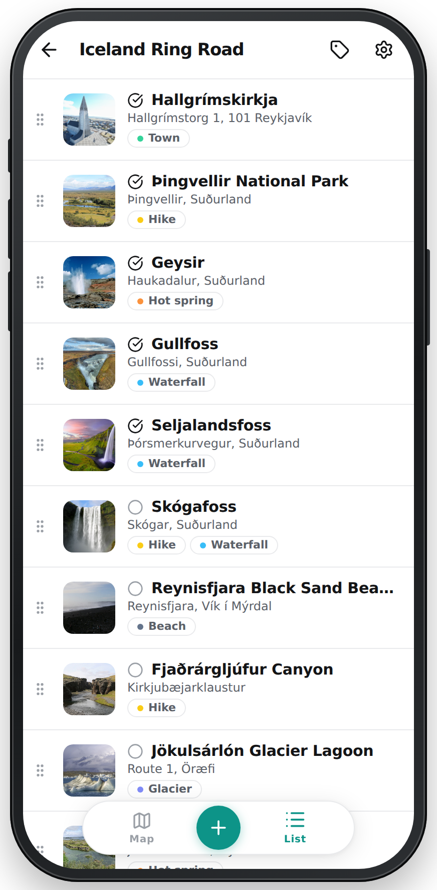&nbsp;
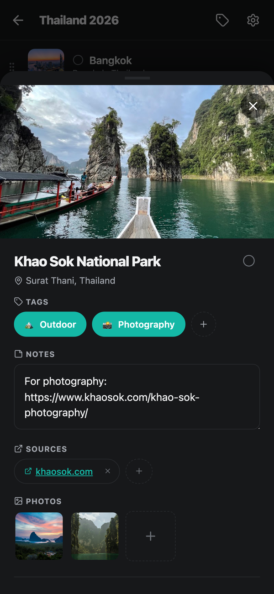

</div>

---

## Contents

- [Feature Tour](#feature-tour)
- [How It's Built](#how-its-built)
- [Self-Hosting Guide](#self-hosting-guide)
  - [1. Prerequisites](#1-prerequisites)
  - [2. Clone and Install](#2-clone-and-install)
  - [3. Create the Supabase Project](#3-create-the-supabase-project)
  - [4. Get Mapbox Tokens](#4-get-mapbox-tokens)
  - [5. Get a Google Places API Key](#5-get-a-google-places-api-key)
  - [6. Configure Environment Variables](#6-configure-environment-variables)
  - [7. Run It](#7-run-it)
  - [8. Deploy](#8-deploy)
  - [9. Edge Functions](#9-edge-functions)
- [Keeping a Free-Plan Project Awake](#keeping-a-free-plan-project-awake)
- [Install It Like an App](#-install-it-like-an-app)
- [Security Model](#security-model)
  - [Invite-Only Mode](#invite-only-mode)
- [Development](#development)
- [Project Structure](#project-structure)
- [License](#license)

---

## Feature Tour

### 🧭 Your Trips, One Shelf

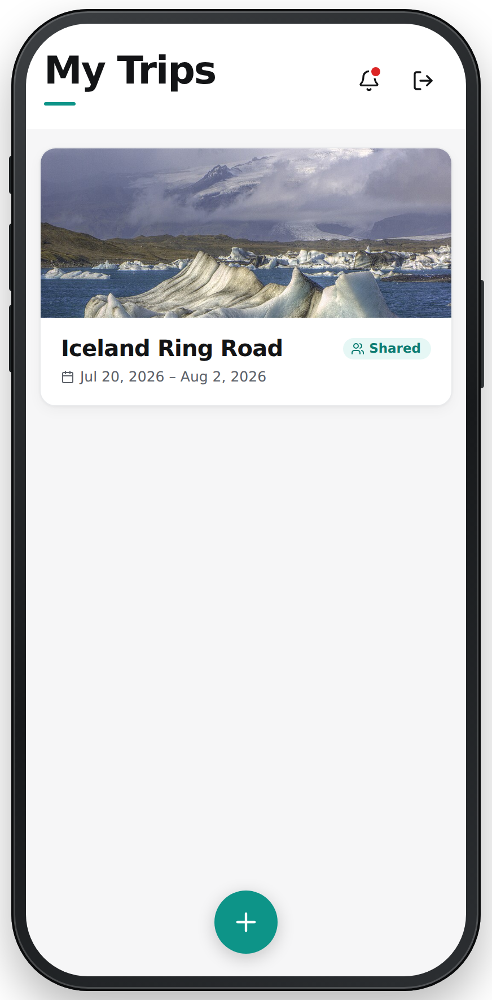

Trips live on cards with a cover photo, dates, and a badge when a trip is
shared with others. The bell in the corner collects activity from your
co-planners across every trip, and the + button starts the next adventure.

Each trip is its own shared space: places, tags, photos, discussion, and the
people you're planning with.

<br clear="right" />

### 🗺️ The Map Is the Plan


Every place in the trip is plotted on a Mapbox map with a marker that carries
its tag's emoji — waterfalls, hot springs, food spots, and hikes are
distinguishable at a glance.

Mark places as **visited** and Cairn draws your actual route between them, in
the order you visited: real road geometry via the Mapbox Directions API, with
a dashed straight-line fallback wherever there is no drivable route (island
hops, ferry crossings). The trip slowly turns into a travel diary while
you're still on the road.

Two switches sit over the map — **Stops** and **Spots** — and whichever is off
says how many pins it is hiding. Spots start hidden, because a city with a
dozen cafés in it is a pile of markers on top of each other at any zoom that
shows the whole route. The first look at a trip is its shape; the detail is
one tap away.

- Tap a marker to open the place
- Filter markers by tag
- One-tap locate-me and compass controls

<br clear="left" />

### 📋 …And So Is the List


The same places as a scrollable list — photo thumbnail, address, tag chips,
and a check for the ones you've already been to.

Drag the handle to reorder; the order is shared, so the list doubles as your
rough itinerary. (Fold a stop before dragging it — a stop showing its spots
hides its handle, because moving it without them would not stick.) Drag a row **sideways** to change what it belongs to — right
to tuck a café under the city it's in, left to pull it back out — and the row
lights up the moment you have dragged far enough for the drop to re-nest it.

A stop with places inside it folds shut, with a count of what it's hiding, so
a long trip stays readable. Map and list are two views over the same trip, and
the pill at the bottom flips between them.

<br clear="right" />

### 🏔️ Stops and Spots

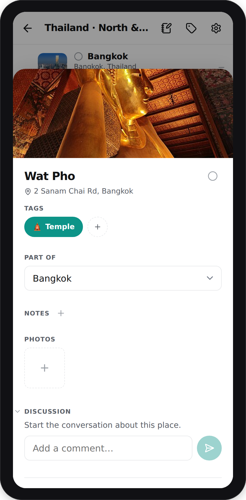

A trip has two kinds of place. A **stop** is somewhere you go — a city, an
island, a lake, a mountain pass. A **spot** is somewhere inside one — a café,
a hotel, a viewpoint, a trailhead. Spots nest under their stop everywhere it
matters: indented on the list, folded away with it, filed under its heading in
the outliner, and hideable on the map.

A place only becomes a spot when there is somewhere to put it: Cairn files it
inside an existing stop within about 15 km, and leaves it as a stop of its own
otherwise. So the first place on a new trip is always a stop, and a café in a
town nobody has marked stays one.

Whether something is venue-shaped at all is decided by three signals in order.
The size of the area Google recommends showing for it comes first — a national
park's is tens of kilometres across, a café's a couple of hundred metres, and
anything that big is ruled out as a spot outright. Then Google's place types,
then the shape of the address.

The guess is only ever made **once, at creation**. A place you have already
filed somewhere is never moved silently. A place still sitting at the top level
gets an offer in the outliner instead — "looks like it's in Bangkok" — and a no
is remembered on your device. You can also set it by hand from the place sheet,
or by dragging a row sideways on the list.

<br clear="left" />

### 📍 Every Place Carries Its Story


Tapping a place opens its detail sheet:

- **Notes** — the practical stuff: parking, opening hours, "bring a rain
  jacket". Paste in the article, reel, or maps link that convinced you this
  place was worth adding — links render as their site name, so six months
  later you still have it without a wall of URL.
- **Photos** — a gallery per place: the Google Places photo it was created
  with (persisted into your own storage so it never expires), plus anything
  you upload yourself.
- **Tags** — color- and emoji-coded, trip-scoped, filterable.
- **Visited toggle** — flip it when you get there; the map route updates.

<br clear="right" />

### 📝 The Whole Trip as One Outline

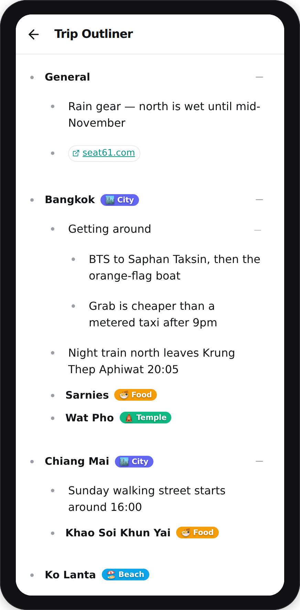

The notebook icon in a trip's top bar opens everything written about that trip
on one screen. Each stop is a heading with its notes as bullets underneath,
spots nested under the stop they belong to, and a **General** section for
anything that isn't about one place.

These are the same notes as on each place's own sheet, seen from the other
side: write a bullet on a place and it appears under that place here.

It behaves like an outliner, not a form:

- **Enter** starts the next bullet
- **Hold a bullet's dot** to pick it up — drag to move it, sideways to change
  its level. Anything nested under it travels too.
- **Swipe a bullet left** to delete it, with an undo in the toast
- **Fold** any heading or bullet that has something under it
- **`@`-mention a place** to link to it; tap the chip to jump there
- Links render as their site name, so a bullet stays readable

On a hardware keyboard, **Tab** and **Shift+Tab** indent and outdent, and
**Alt+Arrow** moves a bullet past its sibling.

Folding is remembered on your own device rather than shared, so collapsing a
section to think doesn't collapse it under a collaborator who is reading it.

<br clear="left" />

### 💬 Talk It Through, Right on the Place

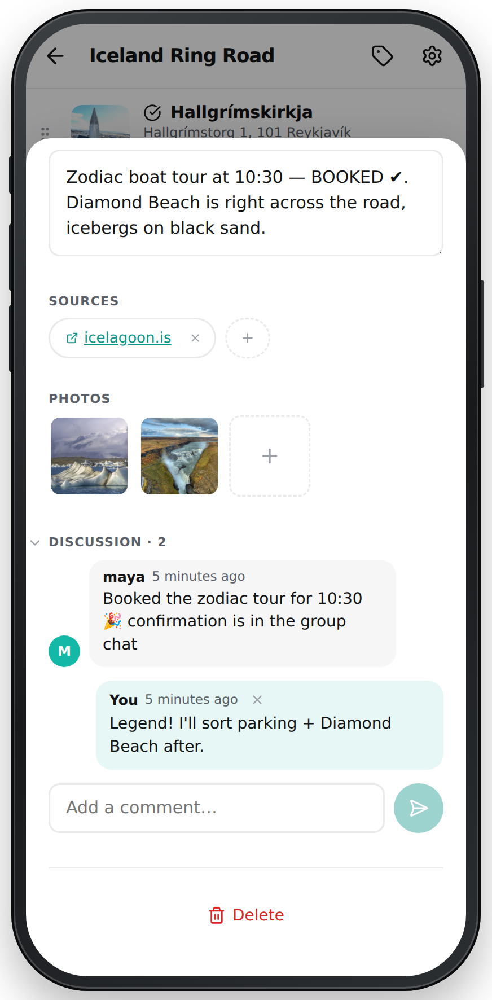

Each place has its own discussion thread, separate from its notes —
"should we book this?", "is it worth the detour?" — so decisions happen next
to the thing being decided, not lost in a group chat.

You can delete your own comments; the trip owner can moderate the thread.

<br clear="right" />

### 🔔 Know What Changed While You Were Away

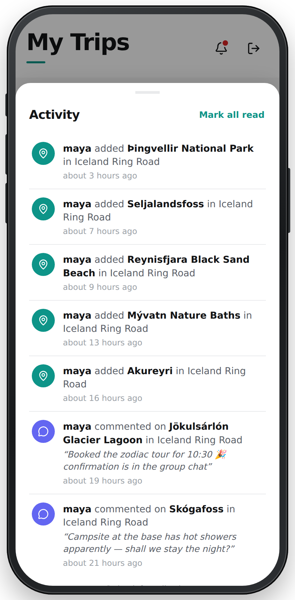

The bell on the trips screen collects what your co-planners did across all
your trips: places they added, comments they posted. Tap an item to jump
straight to that place (comment items open the thread), swipe it away to
dismiss it, or mark everything read at once. Your own actions never notify
you.

<br clear="left" />

### 🔎 Adding a Place Takes Seconds

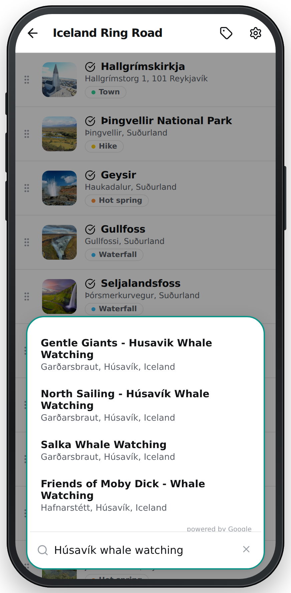

The + button morphs into a search bar backed by Google Places autocomplete —
find anything from "Húsavík whale watching" to a specific restaurant, and it
lands on the map with its name, address, coordinates, and photo already
filled in. A quick-add sheet also lets you paste a link or a photo straight
onto a place.

<br clear="right" />

### 👥 Built for Planning Together

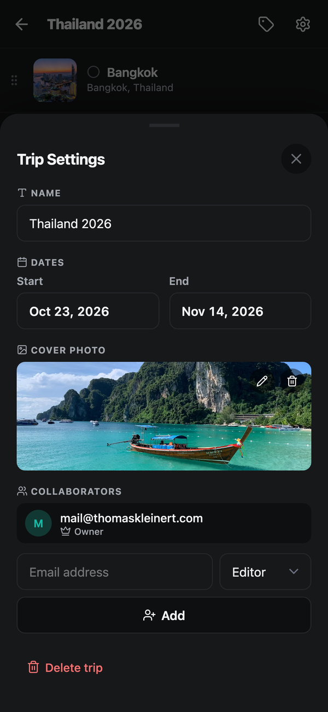

Invite people by email as an **editor** (can add and edit places) or a
**viewer** (read-only). Every invite is a **copyable link**: whoever opens
it and signs in joins the trip — nobody is ever silently added to a trip
they didn't opt into. Invites expire after 30 days and can be revoked while
pending.

Everything — places, tags, photos, reorderings — updates live for the whole
group via Supabase Realtime.

<br clear="left" />

### 🔗 Share a Trip with Anyone

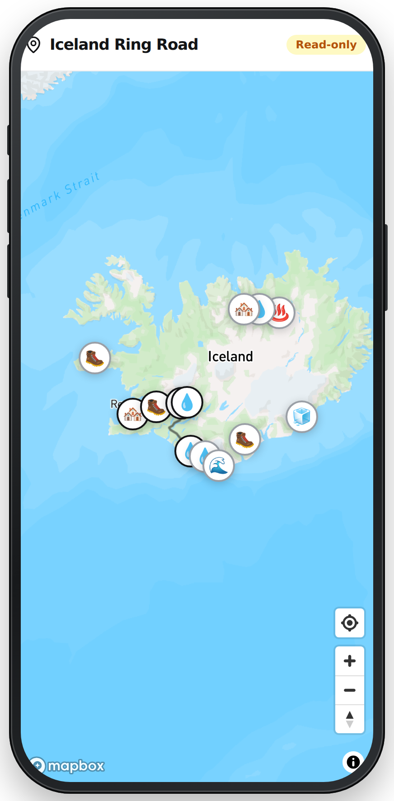

Trip settings has a **read-only share link** that renders the whole trip —
map, places, photos and each place's notes — for anyone who has it, no account
required. Trip-wide notes from the outliner's **General** section stay private.
Send it to the friend who "just wants to see the plan". If a link escapes
further than you meant it to, **reset it** and the old one dies instantly.

There's also a GeoJSON export of the visited route (see
[Edge Functions](#9-edge-functions)) for plotting finished trips on your own
travel map.

<br clear="right" />

### 🔐 Simple Sign-In

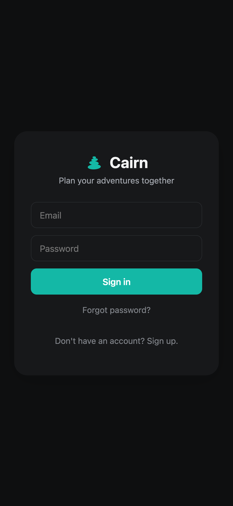

Plain email + password via Supabase Auth — no OAuth apps to configure, no
third-party identity dance. Password reset by email works out of the box,
and changing your password signs out every other session.

Running a private instance? Turn sign-ups off and Cairn becomes
[invite-only](#invite-only-mode): the screen drops its "create account"
option, and a trip invite is the only way an account ever gets made.

<br clear="left" />

---

## How It's Built

**No custom backend server.** The React app talks directly to Supabase and
the map/places APIs; all server-side logic lives in Postgres — Row Level
Security policies and a set of `SECURITY DEFINER` RPCs — plus three small edge
functions (collaborator invites, photo persistence, and the GeoJSON export).

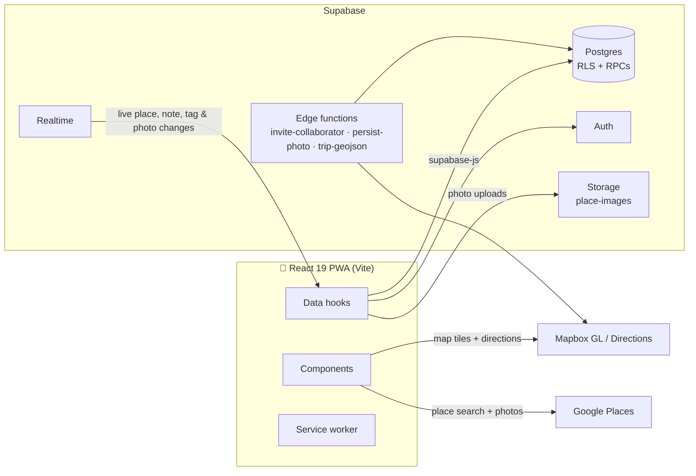

| Layer | Choice |
|---|---|
| Frontend | React 19 + TypeScript (strict), Vite, plain CSS |
| Database | Supabase Postgres — every row gated by trip-membership RLS |
| Auth | Supabase Auth, email + password (optionally invite-only) |
| Live sync | Supabase Realtime (`postgres_changes` on places, notes, tags, photos) |
| Photo storage | Supabase Storage, one public `place-images` bucket (images only, 10 MB cap) |
| Maps & routing | Mapbox GL JS + Mapbox Directions API |
| Place search | Google Maps JavaScript API (Places library) |
| Offline / install | Hand-rolled service worker + web manifest (no framework) |

---

## Self-Hosting Guide

Cairn is designed to be self-hosted: one static frontend + one Supabase
project you own. Everything below fits in the free tiers.

### 1. Prerequisites

- A [Supabase](https://supabase.com) account — database, auth, storage
- A [Mapbox](https://www.mapbox.com) account — map rendering & routing
- A [Google Cloud](https://console.cloud.google.com) project — place search & photos
- Node.js **20.19+**, **22.13+**, or **24+** (what the toolchain requires); npm
- Any static host for the production build (Cloudflare Pages, Netlify,
  Vercel, …)

### 2. Clone and Install

```bash
git clone <your-fork-url> cairn
cd cairn
npm install
```

### 3. Create the Supabase Project

1. Create a new project in the [Supabase dashboard](https://supabase.com/dashboard).
2. Open the **SQL Editor** and run the entire contents of
   [`supabase/schema.sql`](supabase/schema.sql) in one go. Run it once, on a
   fresh project — it uses plain `create table` / `create policy`, so a second
   run fails on objects that already exist. This single file creates
   everything:
   - all tables (`trips`, `trip_members`, `places`, `trip_notes`, `tags`,
     `place_tags`, `place_images`, `trip_invites`, `place_comments`,
     `activity`, …),
   - every Row Level Security policy (all data is scoped to trip membership),
   - the RPCs the app calls (trip creation, invites, share links, comments,
     activity feed, atomic reorder),
   - the public **`place-images`** storage bucket with image-only MIME and
     10 MB size limits,
   - the Realtime publication that makes collaborator edits show up live.
3. Under **Authentication → Sign In / Providers → Email**, make sure
   **Email** sign-up is enabled (it is by default). No OAuth configuration is
   needed. Also decide what to do about **Confirm email**, which is on by
   default: Supabase's built-in mailer only delivers to your own project
   members and is rate-limited to a few messages an hour, so on a fresh
   project the confirmation mail for your first sign-up may never arrive and
   you won't be able to log in. Either turn **Confirm email** off, or
   configure custom SMTP before you sign up.
4. Under **Authentication → URL Configuration**, set the **Site URL** to your
   app's origin and add `https://your-domain.example/**` to **Redirect URLs**
   (plus `http://localhost:5173/**` for development). Invite and password-reset
   links land on real paths, and Supabase silently rewrites any redirect that
   isn't on this list back to the Site URL — which would drop invitees on the
   trip list instead of joining them to the trip.
5. From **Project Settings → API**, note the **Project URL** and the
   **`anon` public key**.

### 4. Get Mapbox Tokens

Sign up at [mapbox.com](https://account.mapbox.com/) and create **two** public
tokens (`pk.…`) on the Access Tokens page. Leave the scopes at their defaults
— `styles:tiles`, `styles:read`, `fonts:read`, `datasets:read` cover both map
rendering and the Directions API used for visited-route drawing.

| Token | Used by | URL restrictions |
|---|---|---|
| **Browser** → `VITE_MAPBOX_TOKEN` | Map tiles and client-side routing | **Restricted** to your domains |
| **Server** → `MAPBOX_TOKEN` secret | `trip-geojson` road snapping | **None** — see below |

On the browser token, add your origins under **URL restrictions**:

```
https://your-domain.example
http://localhost:5173
```

Mapbox does **not** support wildcard characters, so don't write `*.example.com`
or a trailing `/*`. You don't need to — subdomains and subpaths of a listed URL
match automatically, which also covers per-deployment preview URLs. Keep
`localhost` in the list or the map is blank in development.

> **Why two tokens?** URL restrictions are enforced via the `Referer` header,
> so they only work for browser requests. The `trip-geojson` edge function
> calls Directions server-side, where there is no `Referer` — a restricted
> token gets **403** there. Using one restricted token for both is the trap:
> the map keeps working, and the export silently degrades to straight lines
> with no error anywhere. The server token is never shipped to clients; it
> lives only in Supabase secrets.

Since the browser token ships in your JS bundle, treat it as public — the
restrictions limit casual quota theft, they don't make it a secret. Never
commit either token; both belong in environment variables.

<details>
<summary>Verifying a token's restrictions actually work</summary>

Mapbox only enforces URL restrictions on **billable** endpoints. Probing
`/styles/v1/…` (style metadata) returns `200` no matter what you send, so it
will happily tell you an unrestricted token is fine. Test a tile or a
Directions request instead:

```bash
TOKEN=pk.your-browser-token
URL="https://api.mapbox.com/styles/v1/mapbox/streets-v12/tiles/1/0/0?access_token=$TOKEN"

curl -s -o /dev/null -w "no referer : %{http_code}\n" "$URL"
curl -s -o /dev/null -w "your domain: %{http_code}\n" -H "Referer: https://your-domain.example/" "$URL"
```

A correctly restricted token gives **403** then **200**.

Note also that Directions answers a revoked token with HTTP **200** and a body
of `{"message":"Not Authorized - Invalid Token"}` — check the body, not the
status code, when confirming an old token is dead.

</details>

### 5. Get a Google Places API Key

1. In the [Google Cloud Console](https://console.cloud.google.com/), enable
   the **Maps JavaScript API** and **Places API** for a project.
2. Create an API key under **APIs & Services → Credentials**.
3. For production, restrict the key to those two APIs and to your app's
   domain(s). Remember to include your local dev origin
   (e.g. `http://localhost:5173`) if you want search to work in development.

### 6. Configure Environment Variables

Copy the template and fill it in:

```bash
cp .env.example .env.local
```

```bash
VITE_SUPABASE_URL=https://xxxxxxxxxxxx.supabase.co
VITE_SUPABASE_ANON_KEY=eyJ...
VITE_MAPBOX_TOKEN=pk.eyJ...        # the URL-restricted browser token
VITE_GOOGLE_PLACES_KEY=AIza...
```

All four are *publishable* client-side keys — safety comes from RLS (Supabase)
and key restrictions (Google/Mapbox), not from hiding them.

Only the two Supabase values gate the setup screen: without them the app boots
into a checklist instead of crashing. The other two fail later and more
quietly — a missing `VITE_MAPBOX_TOKEN` surfaces as "Couldn't load the map",
and a missing `VITE_GOOGLE_PLACES_KEY` makes place search return nothing at
all. If either of those symptoms appears, check this file first.

### 7. Run It

```bash
npm run dev
```

Open the printed URL, sign up (this creates a real Supabase user — there is
no seed data), create a trip, add a place. That's the whole loop.

### 8. Deploy

```bash
npm run build   # type-checks, builds, and stamps the service worker version
```

Deploy `dist/` to any static host:

- **Build settings** — build command `npm run build`, output directory
  `dist`. Set the same four `VITE_*` variables in the host's dashboard;
  they're baked in at build time, not read at runtime.
- **SPA fallback** — the app uses real paths (`/trip/:id`, `/shared/:token`,
  `/invite/:token`), so unknown paths must fall back to `index.html`. The
  included [`public/_redirects`](public/_redirects) handles this for
  Cloudflare Pages/Netlify; translate it for other hosts (e.g. a Vercel
  `rewrites` rule).
- **Headers** — [`public/_headers`](public/_headers) ships cache rules plus
  a full set of security headers (CSP, HSTS, frame-ancestors, …) already
  tuned for the Supabase/Mapbox/Google endpoints the app talks to. If your
  host uses a different header mechanism, port that file.

### 9. Edge Functions

All three functions live in `supabase/functions/` and are deployed with the
[Supabase CLI](https://supabase.com/docs/guides/functions); their JWT
settings are pinned in [`supabase/config.toml`](supabase/config.toml) so a
plain deploy does the right thing:

```bash
npm install -g supabase        # or: npx supabase <command>
supabase login                 # opens a browser
supabase link --project-ref <your-project-ref>

supabase functions deploy invite-collaborator persist-photo trip-geojson
supabase secrets set APP_ORIGINS="https://your-domain.example,http://localhost:5173"
supabase secrets set MAPBOX_TOKEN=pk.your-unrestricted-server-token
```

`login` and `link` are not optional — without them the deploy fails with
`Cannot find project ref. Have you run supabase link?`. Your project ref is
the subdomain of your Supabase URL. (`--project-ref` also works per-command
if you'd rather not link.)

You can also set both secrets from the dashboard under **Project Settings →
Edge Functions → Secrets**, which avoids installing the CLI. Secrets take
effect immediately — no redeploy needed.

**`invite-collaborator`** — creates the pending invite and, when the invitee
has no account yet, provisions one through the Auth admin API and returns a
one-time link that signs them in. This is what makes
[invite-only mode](#invite-only-mode) possible: the instance can refuse
self-service sign-up entirely, because being invited to a trip becomes the
only way to get an account. The owner still just copies a link and sends it
however they like — no SMTP setup and no dependency on email delivery.

It requires the **`APP_ORIGINS`** secret: a comma-separated allowlist of
origins it may build links for. The client asks for one, but the function
only ever honours an origin from this list — an attacker-chosen redirect
would otherwise hand a live session to their own domain. With the secret
unset the function refuses to issue links at all rather than guessing.

**`persist-photo`** — Google Places photo URLs are temporary and eventually
expire. When a place is added from search, the app calls this function to
copy the photo server-side into your own `place-images` bucket for a
permanent URL (server-side because Google's photo CDN has no CORS headers).
The upload runs under the *caller's* JWT, so the bucket's own RLS decides
what's writable — the function holds no elevated storage privileges. Without
it deployed, the app degrades gracefully and keeps the temporary Google URL.

**`trip-geojson`** — exports a trip's visited route as GeoJSON (road-snapped
legs + stop markers), authorized by the trip's share token:

```
GET https://<project>.supabase.co/functions/v1/trip-geojson?token=<share_token>
```

The `MAPBOX_TOKEN` secret is what enables road snapping; without it the
export still works, but every leg is a straight line instead of a road
route. It **must be the unrestricted server token** from
[step 4](#4-get-mapbox-tokens) — this call has no `Referer`, so a
URL-restricted token gets 403 and you'd get straight lines with no error to
explain why. Routing is capped and cached server-side, so a leaked share
link can't burn unbounded Directions quota.

---

## Keeping a Free-Plan Project Awake

Supabase pauses Free Plan projects after about a week of low **database**
activity, which for a personal instance is easy to hit — nobody opens the app
for a week, the project pauses, and the app is down until you restore it from
the dashboard.

[`infra/supabase-keepalive/`](infra/supabase-keepalive) is a small Cloudflare
Worker that makes a few database requests a day — at times that vary daily —
which is the remedy Supabase documents. It needs only the publishable anon key, and it
calls an existing anon-callable RPC so it adds no new public surface. See its
[README](infra/supabase-keepalive/README.md) for the reasoning and setup.

Not needed on a paid plan — those projects are never paused for inactivity.

---

## 📲 Install It Like an App

Cairn is an installable PWA. On a phone, open it in the browser and use
**Add to Home Screen** (iOS Safari) or the install prompt (Android Chrome)
for a full-screen, app-like experience. The service worker keeps the app
shell cached — previously loaded screens survive flaky connectivity, and an
offline banner tells you when you've lost the network. Each deploy stamps a
fresh cache version, so clients never accumulate stale builds.

---

## Security Model

Worth understanding before you invite the whole group:

- **All trip data is gated by Row Level Security.** Every table's policies
  boil down to *"is the caller a member of this trip?"*, with writes
  requiring the `editor` or `owner` role. Privilege escalation is blocked at
  the column level: only the owner can touch `owner_id`, and the share token
  isn't even readable by other members — it's a bearer credential, served to
  the owner alone via an RPC.
- **Share links and invite links are bearer tokens.** Whoever holds a trip's
  share link can read the whole trip (that's the feature) — treat the link
  like the data, and **reset it from trip settings** if it leaks. Invite
  links join whoever opens them; they expire after 30 days, can be revoked
  while pending, and redeeming one from a previous session always asks for
  confirmation first.
- **Uploaded photos live in a public bucket** (images only, 10 MB max).
  Uploads and deletions are restricted to trip editors, and deleting a
  photo, place, or trip also removes the underlying files — but anyone who
  saved a file's exact URL while it existed could have fetched its bytes.
  Don't upload photos you wouldn't hand to everyone who might see the trip.
- **The frontend ships hardened headers.** `public/_headers` sets a strict
  Content-Security-Policy scoped to the APIs the app actually uses, plus
  HSTS, `frame-ancestors 'none'`, and friends. One consequence worth knowing
  before you edit `public/sw.js`: a service worker inherits the CSP of the
  response that served its script, and that policy governs the fetches the
  *worker* makes. Make it fetch cross-origin and the request dies with
  `ERR_FAILED` the moment the worker takes control.
- **Client-side API keys are publishable, not secret.** The Supabase anon
  key, the Google key and the browser Mapbox token all ship in the bundle by
  design; safety comes from RLS and from key restrictions, so keep the
  Mapbox URL restrictions and Google's API/domain restrictions in place.

### Invite-Only Mode

By default anyone who finds your instance can create an account. They'd see
only their own empty trip list — RLS means they can't reach anyone's data —
but on a personal instance you probably want the door shut.

Because `invite-collaborator` provisions accounts itself, you can close it
completely:

1. Deploy the function and set `APP_ORIGINS` (see
   [Edge Functions](#9-edge-functions)).
2. Confirm your redirect URLs are configured (see
   [step 3](#3-create-the-supabase-project)). Without the `/**` pattern
   Supabase rewrites the invite link's destination back to the Site URL, and
   invitees land on the trip list instead of joining the trip.
3. **Send yourself a test invite at a spare address and complete it**, while
   self-service sign-up is still available as a fallback.
4. Only then, in **Authentication → Sign In / Providers → Email**, turn
   **Allow new users to sign up** off.

Invites keep working exactly as before — the owner types an email, gets a
link, and sends it — but now that link is the *only* way an account comes
into existence. The sign-in screen notices sign-ups are disabled (it reads
GoTrue's public settings endpoint) and stops offering a "create account"
option, so nobody is sent down a path the server will reject.

A first-time invitee clicks the link, lands signed in, picks a password, and
is already in the trip.

---

## Development

```bash
npm run dev      # Vite dev server
npm run build    # tsc -b (strict) + production build + SW version stamp
npm run preview  # serve the production build locally
npm run lint     # eslint (includes the service worker)
```

`.nvmrc` pins the Node version CI uses, so `nvm use` picks a supported one.

There is no test suite yet; `npm run build` is the type-safety gate. CI runs
`npm run lint` and `npm run build` on every push and pull request to `main`
(Node 22), so both must pass before a change lands.

---

## Project Structure

```
src/
  components/     Screens & sheets — TripList, TripView, MapView,
                  PlaceListView, PlaceDetailSheet, TripNotesPage, NoteList,
                  TripSettingsSheet, SharedTripView, …
  hooks/          Data hooks wrapping Supabase — usePlaces, useTripNotes,
                  useTrips, useTags, useComments, useNotifications,
                  useCollaborators, useAuth; plus the interaction hooks
                  useDragReorder (places), useOutlineDrag (bullets),
                  useSwipeToDelete, useFoldState, usePersistentSet,
                  useHistoryLayer, …
  lib/            Supabase client, Mapbox routing, Google photo helpers,
                  storage cleanup, toasts; and the pure rules — outline.ts
                  (bullet depth and where a dropped subtree lands),
                  placeTree.ts (stops and spots), anchor.ts (which kind a new
                  place is), mentions.ts
  types/          Shared TypeScript types
supabase/
  schema.sql      The entire backend: tables, RLS, RPCs, storage bucket,
                  realtime publication. Run once on a fresh project.
  config.toml     Per-function JWT settings for the CLI
  functions/
    invite-collaborator/  Creates invites; provisions accounts for new invitees
    persist-photo/        Copies expiring Google photos into your own bucket
    trip-geojson/         Share-token-gated GeoJSON export of the visited route
infra/
  supabase-keepalive/  Cron Worker that stops a Free-Plan project pausing
public/           PWA manifest, service worker, viewport shim, headers
scripts/          Build helpers (service-worker cache stamping)
docs/             Logo & README screenshots
```

---

## License

[MIT](LICENSE) © Thomas Kleinert — fork it, self-host it, make it yours.

---

<div align="center">
  <sub>
    Screenshots show a demo trip; landscape photos in them are from
    <a href="https://commons.wikimedia.org">Wikimedia Commons</a>.
    Built with <a href="https://react.dev">React</a>,
    <a href="https://supabase.com">Supabase</a> &
    <a href="https://www.mapbox.com">Mapbox</a>.
  </sub>
</div>
