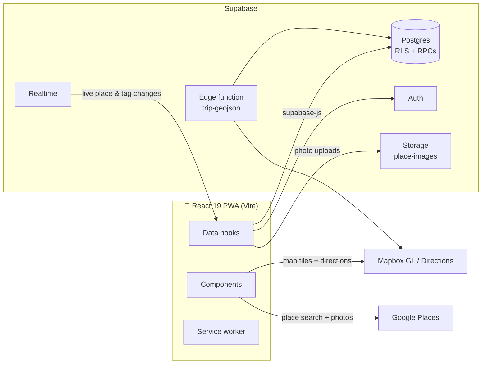

<div align="center">


# Cairn

**Plan your adventures together.**

A collaborative, self-hostable trip planner. Cairn turns a scattered pile of
"we should go here" links, screenshots, and notes into one shared trip: a map
of every place you're considering, a reorderable list, tags, photos, and a
note-and-discussion trail for each stop — all live for everyone you're
traveling with.

[](https://react.dev)
[](https://www.typescriptlang.org/)
[](https://vite.dev)
[](https://supabase.com)
[](https://docs.mapbox.com/mapbox-gl-js/)
[](#-install-it-like-an-app)

<br />

&nbsp;
&nbsp;


</div>

---

## Contents

- [Feature tour](#feature-tour)
- [How it's built](#how-its-built)
- [Self-hosting guide](#self-hosting-guide)
  - [1. Prerequisites](#1-prerequisites)
  - [2. Clone and install](#2-clone-and-install)
  - [3. Create the Supabase project](#3-create-the-supabase-project)
  - [4. Get a Mapbox token](#4-get-a-mapbox-token)
  - [5. Get a Google Places API key](#5-get-a-google-places-api-key)
  - [6. Configure environment variables](#6-configure-environment-variables)
  - [7. Run it](#7-run-it)
  - [8. Deploy](#8-deploy)
  - [9. Optional: edge functions](#9-optional-edge-functions)
- [Install it like an app](#-install-it-like-an-app)
- [Security model](#security-model)
- [Development](#development)
- [Project structure](#project-structure)

---

## Feature tour

### 🗺️ The map is the plan


Every place in the trip is plotted on a Mapbox map with a marker that carries
its tag's emoji — waterfalls, hot springs, food spots, and hikes are
distinguishable at a glance.

Mark places as **visited** and Cairn draws your actual route between them, in
the order you visited: real road geometry via the Mapbox Directions API, with
a dashed straight-line fallback wherever there is no drivable route (island
hops, ferry crossings). The trip slowly turns into a travel diary while you're
still on the road.

- Tap a marker to open the place
- Filter markers by tag
- One-tap locate-me and compass controls

<br clear="right" />

### 📋 …and so is the list


The same places as a scrollable list — photo thumbnail, address, tag chips,
and a check for the ones you've already been to.

Drag the handle to reorder; the order is shared, so the list doubles as your
rough itinerary. Map and list are two views over the same trip, and the pill
at the bottom flips between them.

<br clear="left" />

### 📍 Every place carries its story


Tapping a place opens its detail sheet:

- **Notes** — the practical stuff: parking, opening hours, "bring a rain
  jacket".
- **Sources** — the article, reel, or maps link that convinced you this place
  was worth adding. Six months later you'll want it.
- **Photos** — a gallery per place: the Google Places photo it was created
  with, plus anything you upload yourself.
- **Tags** — color- and emoji-coded, trip-scoped, filterable.
- **Visited toggle** — flip it when you get there; the map route updates.

<br clear="right" />

### 💬 Talk it through, right on the place


Each place has its own discussion thread, separate from the notes field —
"should we book this?", "is it worth the detour?" — so decisions happen next
to the thing being decided, not lost in a group chat.

You can delete your own comments; the trip owner can moderate the thread.

<br clear="left" />

### 🔔 Know what changed while you were away


The bell on the trips screen collects what your co-planners did across all
your trips: places they added, comments they posted. Tap an item to jump
straight to that place (comment items open the thread), swipe it away to
dismiss it, or mark everything read at once. Your own actions never notify
you.

<br clear="right" />

### 🔎 Adding a place takes seconds


The + button morphs into a search bar backed by Google Places autocomplete —
find anything from "Húsavík whale watching" to a specific restaurant, and it
lands on the map with its name, address, coordinates, and photo already
filled in. A quick-add sheet also lets you paste a link or a photo straight
onto a place.

<br clear="left" />

### 👥 Built for planning together


Invite people by email as an **editor** (can add and edit places) or a
**viewer** (read-only):

- If they already have an account, they're added instantly.
- If they don't, Cairn gives you a **copyable invite link**; whoever opens it
  and signs up joins the trip. Invites expire after 30 days and can be
  revoked while pending.

Everything — places, tags, reorderings — updates live for the whole group via
Supabase Realtime.

<br clear="right" />

### 🔗 Share a trip with people who don't have an account


Every trip has a share link (`/shared/<token>`) that renders a **read-only**
version of the whole trip — map, places, notes, photos — for anyone who has
the link, no sign-in required. Send it to the friend who "just wants to see
the plan".

There's also a GeoJSON export of the visited route (see
[edge functions](#9-optional-edge-functions)) for plotting finished trips on
your own travel map.

<br clear="left" />

<div align="center">
  &nbsp;&nbsp;
  
  <p><em>Trips live on cards with cover photos; auth is plain email + password — no OAuth setup needed.</em></p>
</div>

---

## How it's built

**No custom backend server.** The React app talks directly to Supabase and
the map/places APIs; all server-side logic lives in Postgres — Row Level
Security policies and a set of `SECURITY DEFINER` RPCs — plus one optional
edge function for the GeoJSON export.



| Layer | Choice |
|---|---|
| Frontend | React 19 + TypeScript, Vite, plain CSS |
| Database | Supabase Postgres — every row gated by trip-membership RLS |
| Auth | Supabase Auth, email + password |
| Live sync | Supabase Realtime (`postgres_changes` on `places` and `tags`) |
| Photo storage | Supabase Storage, one public `place-images` bucket |
| Maps & routing | Mapbox GL JS + Mapbox Directions API |
| Place search | Google Maps JavaScript API (Places library) |
| Offline / install | Hand-rolled service worker + web manifest (no framework) |

---

## Self-hosting guide

Cairn is designed to be self-hosted: one static frontend + one Supabase
project you own. Everything below fits in the free tiers.

### 1. Prerequisites

- A [Supabase](https://supabase.com) account — database, auth, storage
- A [Mapbox](https://www.mapbox.com) account — map rendering & routing
- A [Google Cloud](https://console.cloud.google.com) project — place search & photos
- Node.js **20+** and npm
- Any static host for the production build (Cloudflare Pages, Netlify,
  Vercel, …)

### 2. Clone and install

```bash
git clone <your-fork-url>
cd travel-planner
npm install
```

### 3. Create the Supabase project

1. Create a new project in the [Supabase dashboard](https://supabase.com/dashboard).
2. Open the **SQL Editor** and run the entire contents of
   [`supabase/schema.sql`](supabase/schema.sql) in one go. This single file
   creates everything:
   - all tables (`trips`, `trip_members`, `places`, `tags`, `place_tags`,
     `place_images`, `trip_invites`, `place_comments`, `activity`, …),
   - every Row Level Security policy (all data is scoped to trip membership),
   - the RPCs the app calls (trip creation, invites, comments, activity feed,
     shared-trip reads),
   - the public **`place-images`** storage bucket and its access policies,
   - the Realtime publication that makes collaborator edits show up live.
3. Under **Authentication → Sign In / Providers**, make sure **Email**
   sign-up is enabled (it is by default). No OAuth configuration is needed.
4. From **Project Settings → API**, note the **Project URL** and the
   **`anon` public key**.

### 4. Get a Mapbox token

Sign up at [mapbox.com](https://account.mapbox.com/) and copy your **default
public token** (`pk.…`) from the Access Tokens page. The default scopes cover
both map rendering and the Directions API used for visited-route drawing.

### 5. Get a Google Places API key

1. In the [Google Cloud Console](https://console.cloud.google.com/), enable
   the **Maps JavaScript API** and **Places API** for a project.
2. Create an API key under **APIs & Services → Credentials**.
3. For production, restrict the key to those two APIs and to your app's
   domain(s). Remember to include your local dev origin
   (e.g. `http://localhost:5173`) if you want search to work in development.

### 6. Configure environment variables

Create `.env.local` in the project root:

```bash
VITE_SUPABASE_URL=https://xxxxxxxxxxxx.supabase.co
VITE_SUPABASE_ANON_KEY=eyJ...
VITE_MAPBOX_TOKEN=pk.eyJ...
VITE_GOOGLE_PLACES_KEY=AIza...
```

All four are *publishable* client-side keys — safety comes from RLS (Supabase)
and key restrictions (Google/Mapbox), not from hiding them. If any are
missing, the app boots into a setup checklist instead of crashing.

### 7. Run it

```bash
npm run dev
```

Open the printed URL, sign up (this creates a real Supabase user — there is
no seed data), create a trip, add a place. That's the whole loop.

### 8. Deploy

```bash
npm run build   # type-checks, then outputs a static dist/
```

Deploy `dist/` to any static host:

- **Build settings** — build command `npm run build`, output directory
  `dist`. Set the same four `VITE_*` variables in the host's dashboard;
  they're baked in at build time, not read at runtime.
- **SPA fallback** — the app uses real paths (`/trip/:id`, `/shared/:token`,
  `/invite/:token`), so unknown paths must fall back to `index.html`. The
  included [`public/_redirects`](public/_redirects) handles this for
  Cloudflare Pages/Netlify; translate it for other hosts (e.g. a Vercel
  `rewrites` rule).
- **Cache headers** — [`public/_headers`](public/_headers) ships sane
  no-cache rules for the HTML shell and service worker so deploys roll out
  cleanly.

### 9. Optional: edge functions

Two features degrade gracefully without their edge function; deploy them if
you want them.

**`trip-geojson` (included)** — exports a trip's visited route as GeoJSON
(road-snapped legs + stop markers), authorized by the trip's share token:

```bash
supabase functions deploy trip-geojson --no-verify-jwt
supabase secrets set MAPBOX_TOKEN=pk.your-own-token
```

`--no-verify-jwt` matters: callers authenticate with the share token, not a
Supabase session. Set your own `MAPBOX_TOKEN` secret — otherwise the function
falls back to the app author's public token and your exports draw down their
Directions quota. Then:

```
GET https://<project>.supabase.co/functions/v1/trip-geojson?token=<share_token>
```

**`persist-photo` (not included yet)** — Google Places photo URLs are
temporary and eventually expire. The app tries to call an edge function named
`persist-photo` to copy the photo server-side into your `place-images` bucket
for a permanent URL (server-side because Google's photo CDN has no CORS
headers). Without it the app simply keeps the temporary Google URL, which
will stop loading for old places at some point. If you want permanent photos,
deploy your own function with this contract: accept `{ photoUrl, path }`
(JWT-authenticated), fetch `photoUrl`, upload the bytes to `place-images` at
`path` (validate that `path` stays inside a trip the caller can edit), and
return `{ url }`.

---

## 📲 Install it like an app

Cairn is an installable PWA. On a phone, open it in the browser and use
**Add to Home Screen** (iOS Safari) or the install prompt (Android Chrome)
for a full-screen, app-like experience. The service worker keeps the app
shell cached — previously loaded screens survive flaky connectivity, and an
offline banner tells you when you've lost the network.

---

## Security model

Worth understanding before you invite the whole group:

- **All trip data is gated by Row Level Security.** Every table's policies
  boil down to *"is the caller a member of this trip?"*, with writes
  requiring the `editor` or `owner` role. Privilege escalation is blocked at
  the column level: only the owner can touch `owner_id`, and nobody can
  rewrite `share_token`.
- **Share links and invite links are bearer tokens.** Whoever holds a trip's
  share token can read the whole trip (that's the feature) — treat the link
  like the data. Invite links make whoever opens them a member; they expire
  after 30 days and can be revoked while pending.
- **Uploaded photos live in a public bucket.** Uploads and deletions are
  restricted to trip editors, but anyone who has a file's exact URL can fetch
  its bytes. Don't upload photos you wouldn't hand to everyone who might see
  the trip.
- **Email sign-ups are open by default.** Anyone who finds your instance can
  create an account (they'll see only their own trips). If you want a private
  instance, disable sign-ups in Supabase Auth settings after creating your
  accounts.

---

## Development

```bash
npm run dev      # Vite dev server
npm run build    # tsc -b + production build into dist/
npm run preview  # serve the production build locally
npm run lint     # eslint
```

There is no test suite yet; `npm run build` is the type-safety gate.

---

## Project structure

```
src/
  components/     Screens & sheets — TripList, TripView, MapView,
                  PlaceDetailSheet, TripSettingsSheet, SharedTripView, …
  hooks/          Data hooks wrapping Supabase — usePlaces, useTrips, useTags,
                  useComments, useNotifications, useCollaborators, useAuth
  lib/            Supabase client, Mapbox routing, Google photo helpers, toasts
  types/          Shared TypeScript types
supabase/
  schema.sql      The entire backend: tables, RLS, RPCs, storage bucket,
                  realtime publication. Run once on a fresh project.
  functions/
    trip-geojson/ Share-token-gated GeoJSON export of a trip's visited route
public/           PWA manifest, service worker, redirect & header rules
docs/             Logo & README screenshots
```

---

<div align="center">
  <sub>
    Screenshots show a demo trip; landscape photos in them are from
    <a href="https://commons.wikimedia.org">Wikimedia Commons</a>.
    Built with <a href="https://react.dev">React</a>,
    <a href="https://supabase.com">Supabase</a> &
    <a href="https://www.mapbox.com">Mapbox</a>.
  </sub>
</div>
